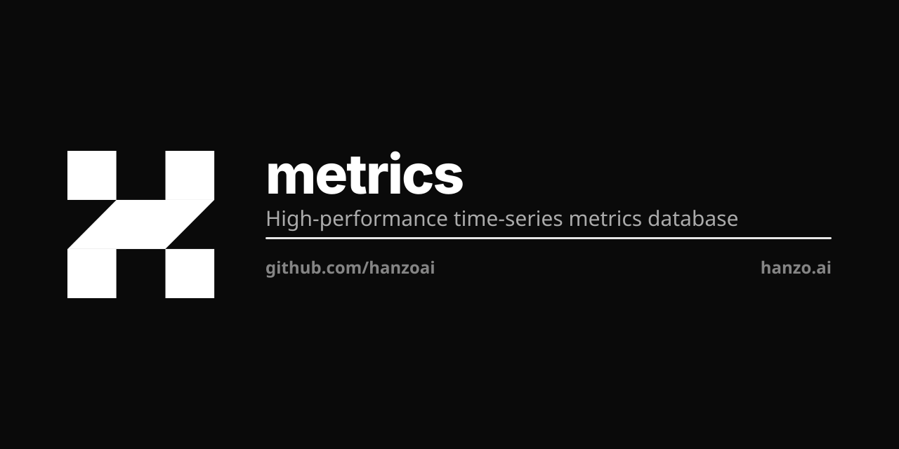

> **Archived.** Hanzo Metrics is superseded by [hanzoai/o11y](https://github.com/hanzoai/o11y),
> which serves metrics, logs and traces from one subsystem at `/v1/o11y/*`. Nothing new
> should depend on this repository; it is kept read-only for history. What follows
> describes the retired product.
>
> [**NOTICE**](NOTICE) says where each of the eleven routes went, what was measured
> before the eight duplicate doors were deleted, and why the last commit written
> here is obsolete rather than pending. `hanzoai/cloud` was the only importer and
> no longer imports it.

<p align="center"></p>

# Hanzo Metrics

High-performance time-series metrics database.

## Overview

Hanzo Metrics is a fast, cost-effective time-series database optimized for monitoring AI infrastructure. Store billions of data points with excellent compression and query performance for your observability needs.

## Features

- **High Performance**: Fast ingestion and queries
- **Efficient Storage**: 10x compression vs alternatives
- **PromQL Compatible**: Use familiar Prometheus queries
- **Long-term Storage**: Cost-effective retention
- **High Availability**: Clustering and replication
- **Multi-tenancy**: Isolated tenant data

## Quick Start

```bash
docker run -p 8428:8428 hanzo/metrics
```

## Documentation

See the [documentation](https://hanzo.ai/docs/metrics) for detailed guides and API reference.

## License

MIT License - see [LICENSE](LICENSE) for details.
